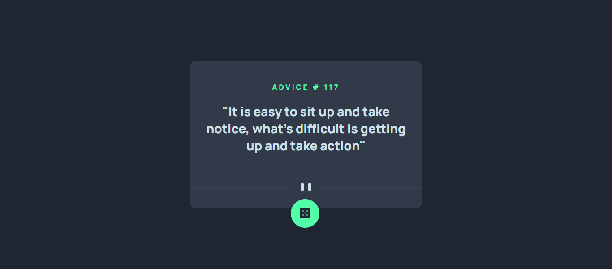
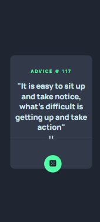

# Frontend Mentor - Advice generator app solution

This is a solution to the [Advice generator app challenge on Frontend Mentor](https://www.frontendmentor.io/challenges/advice-generator-app-QdUG-13db). Frontend Mentor challenges help you improve your coding skills by building realistic projects.

## Table of contents

  - [The challenge](#the-challenge)
  - [Screenshot](#screenshot)
  - [Links](#links)
  - [Built with](#built-with)
  - [Author](#author)

### The challenge
advice-generator-app

### Screenshot

)
)

### Links

- Solution URL: https://github.com/Ketema741/FrontEndProject.git
- Live Site URL: https://ketema741.github.io/FrontEndProject/

### Built with
- HTML5 
- CSS custom properties
- JS

## Author

- linkedin - [Ketema Girma](https://www.linkedin.com/in/ketema-girma-608729228/)
- Frontend Mentor - [@Ketema741](https://www.frontendmentor.io/profile/Ketema741)
- Twitter - [@KetemaGirma3](https://www.twitter.com/KetemaGirma3)
